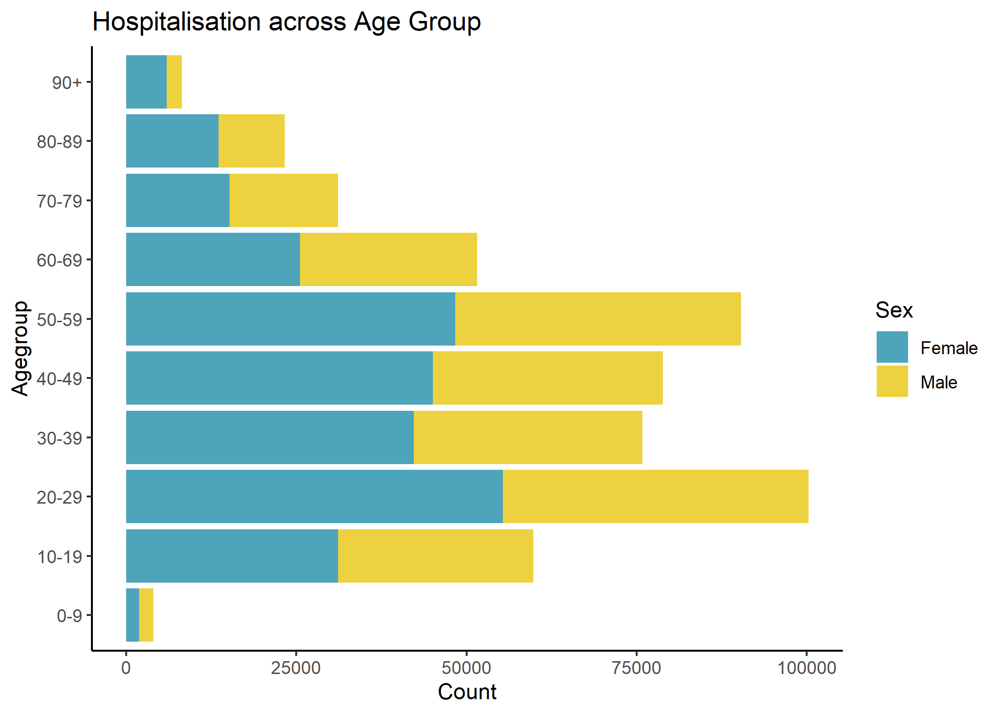
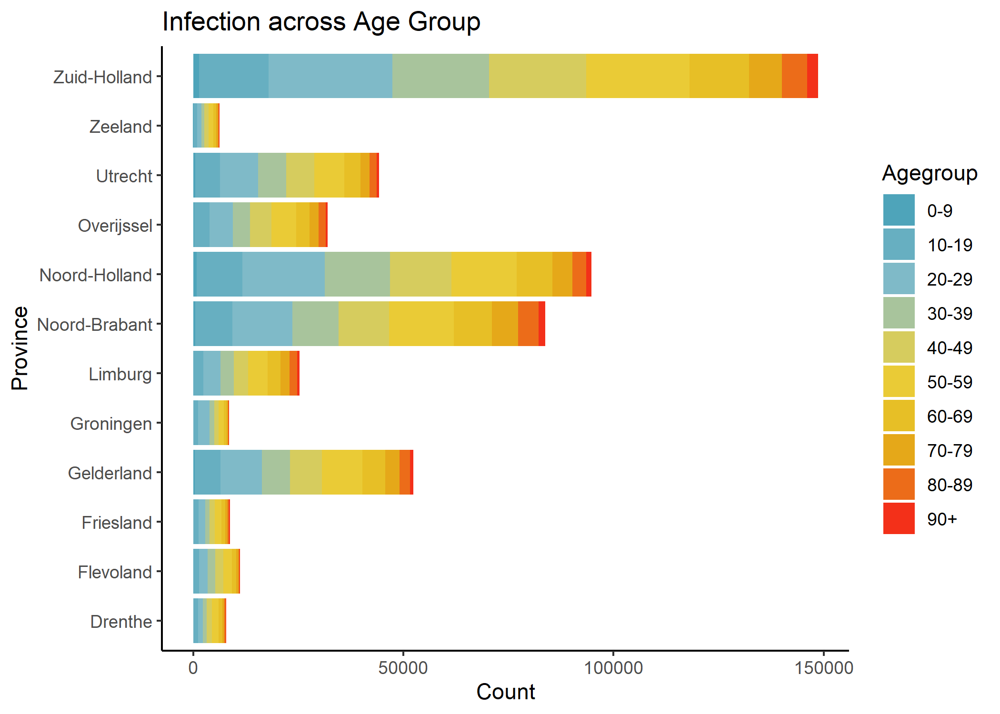
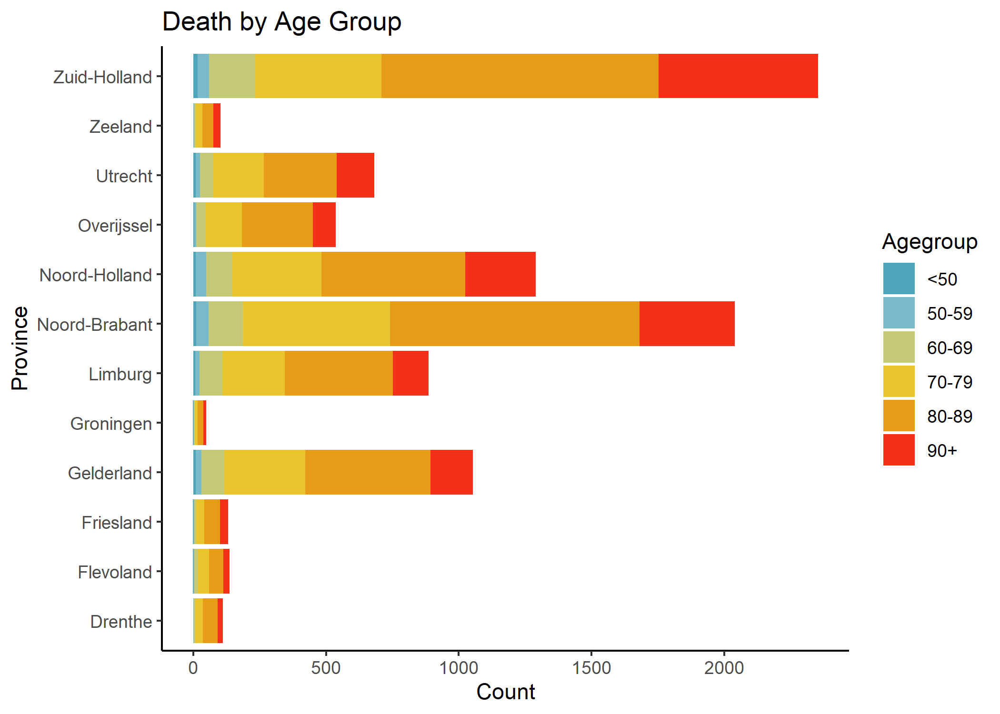
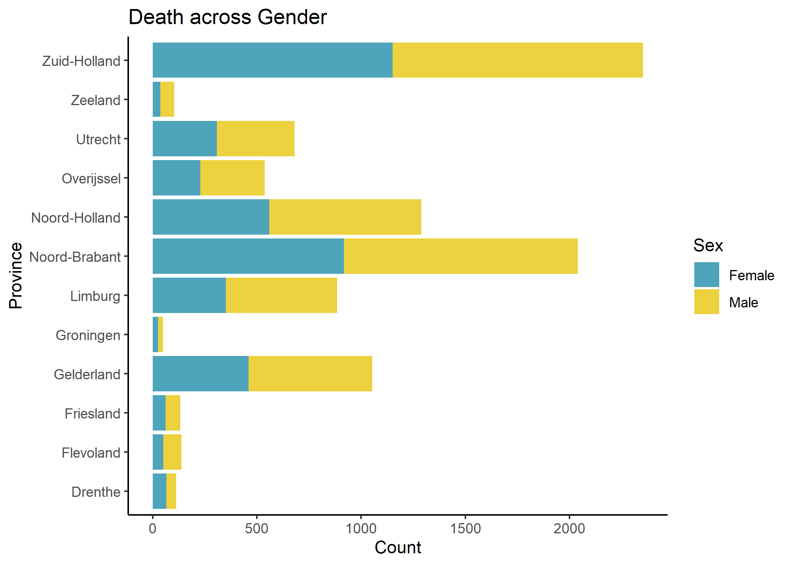

```r
library(ISLR)
library(dplyr)
```

```
## 
## Attaching package: 'dplyr'
```

```
## The following objects are masked from 'package:stats':
## 
##     filter, lag
```

```
## The following objects are masked from 'package:base':
## 
##     intersect, setdiff, setequal, union
```

```r
library(tidyverse)
```

```
## -- Attaching packages --------------------------------------- tidyverse 1.3.0 --
```

```
## v ggplot2 3.3.2     v purrr   0.3.4
## v tibble  3.0.3     v stringr 1.4.0
## v tidyr   1.1.1     v forcats 0.5.0
## v readr   1.4.0
```

```
## -- Conflicts ------------------------------------------ tidyverse_conflicts() --
## x dplyr::filter() masks stats::filter()
## x dplyr::lag()    masks stats::lag()
```

```r
library(haven)
library(readxl)
library(Matrix)
```

```
## 
## Attaching package: 'Matrix'
```

```
## The following objects are masked from 'package:tidyr':
## 
##     expand, pack, unpack
```

```r
library(tinytex)
library(ggplot2)
library(wesanderson)
library(png)
```


Import data and check data format.


Begin cleaning the data.

```
## Warning in `==.default`(Date_statistics, c("31/10/2020", "30/10/2020",
## "29/10/2020", : longer object length is not a multiple of shorter object length
```

```
## Warning in is.na(e1) | is.na(e2): longer object length is not a multiple of
## shorter object length
```


<!-- -->

<!-- -->

<!-- -->


<!-- -->

<!-- -->


